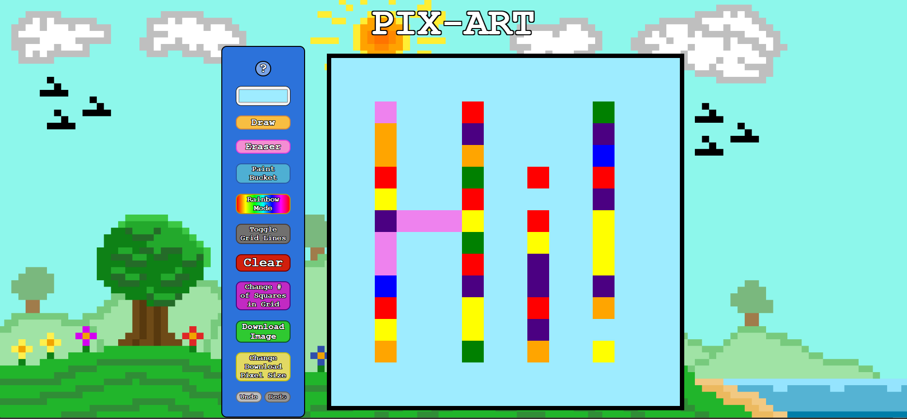

# Pix-Art
---
Project made to practice CSS, HTML, and JS (mainly using flexbox and manipulating DOM elements) 
following the Odin Project Foundations Course, originally as etch-a-sketch

Many additional details were added for practice and now it can be used to create pixel art

[Live Website](https://austin-tsai.github.io/pix-art/)

Switch between draw, eraser, bucket, and rainbow modes  
Shift click with the eraser and rainbow modes active to have a bucket effect

Hotkeys are:  
(1) color eye dropper  
(2) color picker
(3) draw  
(4) eraser  
(5) bucket  
(6) rainbow  
(7) toggle background image  
(ctrl+z/cmd+z) undo  
(ctrl+y/cmd+y) redo  
Download the image when you're done (use the change download pixel size button for a larger/smaller image)

Fun Fact: All of the custom cursors, the background, and the favicon were made in this website

*Colors seem to break if using a dark mode extension like Dark Reader so disable those

